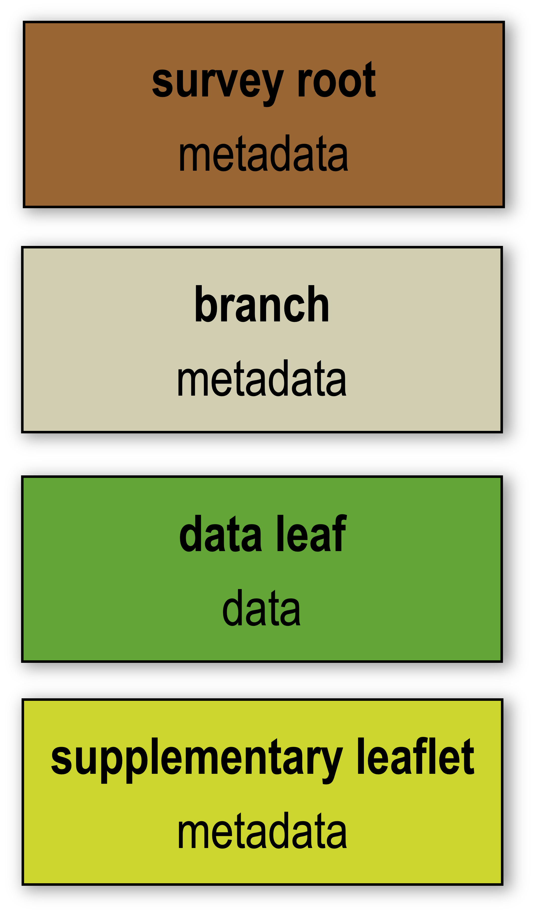

****************
The GS Data Tree
****************

.. image:: simple_data_tree.png
   :width: 600px
   :align: center

The GS data standard utilizes hierarchical groups to structure data and metadata within the same netCDF file. GSPy implements this architecture by extending `Xarray's DataTree class <https://docs.xarray.dev/en/latest/generated/xarray.DataTree.html>`_. We recommend Xarray's User Guide on `Hierarchical Data <https://docs.xarray.dev/en/stable/user-guide/hierarchical-data.html>`_ for an introduction to DataTrees.

There is no limit to the number of groups that can be in a GS netCDF file, and users are free to define the names of all groups except for the required top level "survey" group. However, the location and treatment of each group is strictly controlled based on the type of information it contains. 

Every GS file requires, at a minimum, three tiers:

1. **Survey Root** - top level of any GS file, underneath the true root “/”, containing global information about the geophysical survey, i.e., who, what, where, when, and why.

2. **Branch Node** - simply a container group for organizational purposes, but may contain additional metadata information for the data leaves contained within it. 

3. **Data Leaf** - the principal data location. Can be unstructured (tabular) or structured (raster) data.

and the optional fourth tier: 

4. **Supplementary Leaflet** - additional metadata specific to individual data leaves that goes beyond what can fit cleanly within the attributes of the data group itself. Examples includes geophysical system information such as for electromagnetic systems or detailed inversion information and parameter values. 

Example GS Data Tree
====================

.. figure:: example_data_tree.png
   :width: 800px
   :align: center

   This simplified example GS file structure represents a common lifecyle for geophysical data (raw data, processed data, inverted models) with hypothetical added complexity to demonstrate how the GS Data Tree can be adapted. The raw and processed datasets are stored as individual data leaves underneath the "data" branch, and system information is attached to each respective dataset. One-dimensional inverted models are stored in the "inversion_1D" branch, with inversion parameters attached as a supplementary leaflet. Then, as an example of possible complexity, the "inversion_3D" branch contains two sub-branch nodes for "inset" and "regional", each of which contains two data leaves representing differing inversion settings. 

For more detailed information on the GS Data Standard and its requirements, see the :doc:`GS convention <../../gspy_convention_requirements>` page.

