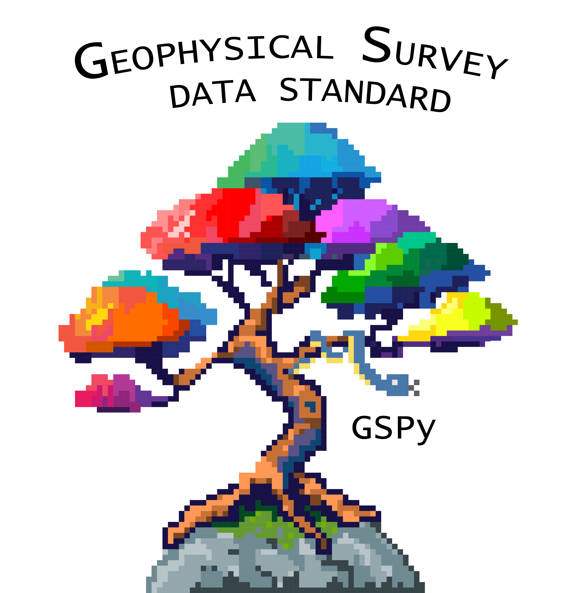

####################################################
Welcome to GSPy: Geophysical Data Standard in Python
####################################################

|

This package provides functions and workflows for standardizing geophysical datasets based on the Geophysical Survey (GS) data standard. The current implementation follows the :doc:`GS Data Tree <content/getting_started/gs_data_tree>` framework and supports both tabular (unstructured/scattered) and raster (structured/gridded) datasets.

Goals of the GS Data Standard & GSPy
~~~~~~~~~~~~~~~~~~~~~~~~~~~~~~~~~~~~

   1. Standardize geophysical data with a format based on the `netCDF <https://www.unidata.ucar.edu/software/netcdf/>`_ file format and `Climate and Forecast (CF) metadata conventions <http://cfconventions.org/>`_.
   2. Restructure various types of geophysical data (e.g., raw and processed data, inverted models, or derivative products) into a consistent format for sharing and archiving.
   3. Document critical metadata pertinent to geophysical analysis and transferability.
   4. Develop tools for generating and exploring standardized datasets, and facilitate handling of complex and diverse data and metadata information to accurately process, invert, and interpret geophysical data.
   5. Develop visualization and exploratory tools to interrogate data.

Why netCDF?
~~~~~~~~~~~

   * **Metadata documentation** - detailed metadata is directly attached to the digital data values as variable-specific attributes (e.g., names, units, null values, value ranges) and as dataset attributes.
   * **Hierarchical structure** - multiple datasets can be organized into a single file within a tiered group structure. The GS standard takes advantage of this to define standardized group types and ordering to create an adaptable framework for organizing complex datasets with critical supporting information such as survey and acquisition details, system configurations, and modeling parameters.
   * **Portable and accessible format** - netCDF is platform-independent and supports subsetting which keeps large datasets accessible and easy to use.
   * **Well-established metadata conventions** - the CF convention provides a strong foundation for standardizing metadata and is widely recognized for netCDF files. For example, by following the CF guidelines for coordinate reference system (CRS) variables all GS files are accurately represented in GIS software (QGIS, ArcGIS, etc).
   * **Space-saving and scalable** - netCDF is a binary format with extra packing and compression options to significantly reduce file sizes, and is immediately scalable for large datasets with efficient read/write and parallel capabilities.

GSPy Workflow
~~~~~~~~~~~~~

The GSPy package provides tools for reading datasets from a variety of original formats common for geophysical data (e.g., CSV, `ASEG-GDF <https://www.aseg.org.au/sites/default/files/pdf/ASEG-GDF2-REV4.pdf>`_, GeoTIFF), combining with metadata information, and generating standardized GS netCDF files.  

See our examples for detailed demonstrations of the GSPy workflow. In general, the steps for making a GS netCDF file are:

   1. Initiate a Survey

      * pass a metadata file (YAML or JSON) with global information about the survey

   2. Add a Container branch
   3. Add data to the Container branch

      * pass a data file 
      * pass a metadata file

   4. (optional) Add Supplementary Stem 

      * this can also be done simultaneous with Step 3 through the data's metadata file

   5. Repeat steps 2-4 for each dataset as needed
   6. Export to File

---------------------------

.. toctree::
   :maxdepth: 12

   content/getting_started/getting_started
   content/metadata/index
   examples/index
   gspy_convention_requirements
   content/api/api
   references
